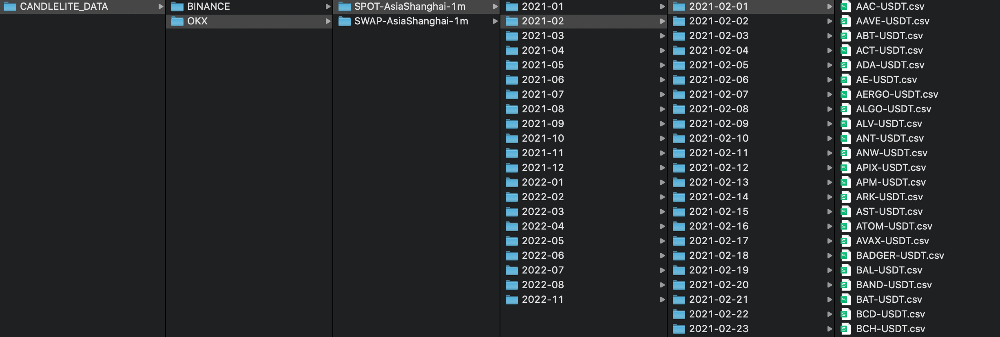
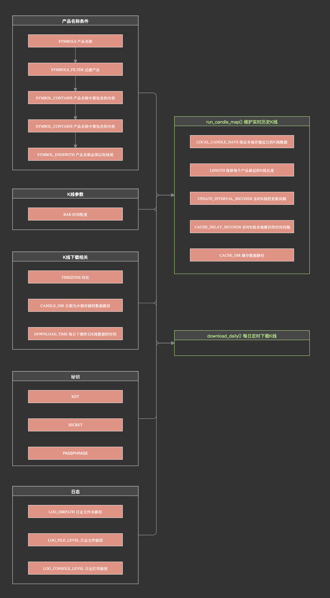

# Okx_candle

## 1 Okx_candle的设计目的？

**1.为本地模拟交易提供历史数据**

- 支持OKX交易所中：SPOT现货交易、SWAP永续合约、FUTURES交割合约、OPTION期权的历史K线下载、管理与快速读取。

**2.为实盘交易决策依据**

- 支持现货、合约与期权产品实时最新历史K线数据的缓存更新
- 获取实时行情数据

**与Binance_candle的使用方法95%以上相似，降低多平台量化交易者的学习成本**

## 2 安装Okx_candle

GITHUB：https://github.com/pyted/okx_candle

```cmd
pip3 install okx_candle
```

## 3 快速开始

### 3.1 维护产品实时历史K线数据candle_map


以永续合约为例，运行run_candle_map函数后，会以多线程的方式维护candle_map属性，保证candle_map的时效性。

candle_map的格式：candle_map[\<symbol:str\>] = \<candle:np.ndarray\>

```python
from okx_candle import CandleServer
from ppring import pprint

candleServer = CandleServer('SWAP')  # SWAP 永续合约
candleServer.run_candle_map()
pprint(candleServer.candle_map)
```

输出：

```text
>> {
>>     'BTC-USD-SWAP': array([[1.67556558e+12, 2.33180000e+04, 2.33181000e+04, ...,
>>             1.92990000e+00, 4.50000000e+04, 1.00000000e+00],
>>             [1.67556564e+12, 2.33178000e+04, 2.33178000e+04, ...,
>>             7.12200000e-01, 1.66000000e+04, 1.00000000e+00],
>>             [1.67556570e+12, 2.33078000e+04, 2.33078000e+04, ...,
>>             6.67600000e+00, 1.55600000e+05, 1.00000000e+00],
>>             ...,
>>             [1.67573820e+12, 2.28659000e+04, 2.28868000e+04, ...,
>>             3.51203000e+01, 8.03500000e+05, 1.00000000e+00],
>>             [1.67573826e+12, 2.28770000e+04, 2.28849000e+04, ...,
>>             1.07466000e+01, 2.45900000e+05, 1.00000000e+00],
>>             [1.67573832e+12, 2.28851000e+04, 2.28872000e+04, ...,
>>             7.61250000e+00, 1.74200000e+05, 1.00000000e+00]]),
>>     ... ...
>> }
```

### 3.2 每日定时下载历史K线

以现货交易为例，每天定时下载前一天的历史K线数据。

```python
from okx_candle import CandleServer

candleServer = CandleServer('SPOT')  # SPOT：现货交易
candleServer.download_daily()
```

### 3.3 获取实时全部产品的行情信息

以SWAP永续合约为例，获取实时行情信息

```python
from okx_candle import CandleServer
from pprint import pprint

candleServer = CandleServer('SWAP') # SWAP 永续合约
bookTickerMap = candleServer.market.get_tickersMap()
pprint(bookTickerMap)
```

输出：

```text
>> {'code': '0',
>>  'data': {'1INCH-USD-SWAP': {'askPx': '0.5533',
>>                              'askSz': '25',
>>                              'bidPx': '0.5529',
>>                              'bidSz': '25',
>>                              'high24h': '0.5731',
>>                              'instId': '1INCH-USD-SWAP',
>>                              'instType': 'SWAP',
>>                              'last': '0.5534',
>>                              'lastSz': '25',
>>                              'low24h': '0.5449',
>>                              'open24h': '0.5702',
>>                              'sodUtc0': '0.5535',
>>                              'sodUtc8': '0.5705',
>>                              'ts': '1675746122612',
>>                              'vol24h': '38496',
>>                              'volCcy24h': '686356.4046'},
>>           '1INCH-USDT-SWAP': {'askPx': '0.5529',
>>                               'askSz': '602',
>>                               'bidPx': '0.5528',
>>                               'bidSz': '1309',
>>                               'high24h': '0.5742',
>>                               'instId': '1INCH-USDT-SWAP',
>>                               'instType': 'SWAP',
>>                               'last': '0.5528',
>>                               'lastSz': '1',
>>                               'low24h': '0.5447',
>>                               'open24h': '0.5697',
>>                               'sodUtc0': '0.5545',
>>                               'sodUtc8': '0.5698',
>>                               'ts': '1675746159138',
>>                               'vol24h': '11849879',
>>                               'volCcy24h': '11849879'},
>>             ... ...
>>         },
>>  'msg': ''}
```

## 4 历史K线candle的数据说明

### 4.1 K线的格式

为了保证运算的速度，candle采用np.ndarray类型存储。

|列索引|参数名|字段解释|例子|
|:---|:---|:---|:---|
|0|ts|开盘时间|1597026383085.0|
|1|o|开盘价格|3.721|
|2|h|最高价格|3.743|
|3|l|最低价格|3.677|
|4|c|收盘价格|3.708|
|5|vol|交易量，以张为单位<br/>如果是衍生品合约，数值为合约的张数<br/>如果是币币/币币杠杆，数值为交易货币的数量|8422410.0|
|6|volCcy|交易量，以币为单位<br/>如果是衍生品合约，数值为交易货币的数量<br/>如果是币币/币币杠杆，数值为计价货币的数量|22698348.04828491|
|7|volCcyQuote|交易量，以计价货币为单位<br/>如：BTC-USDT和BTC-USDT-SWAP单位均是 USDT；<br/>BTC-USD-SWAP 单位是 USD|12698348.04828491|
|8|confirm|K线状态<br/>0 代表 K 线未完结<br/>1 代表 K 线已完结|1.0|


官方返回的字段类型均为字符串，但对于历史K线数据，Okx_candle中均以np.float64作为存储格式。

注：Python对于数字精度的支持并不优秀，对于模拟运算或者实盘决策，使用浮点数是安全的，但对于交易接口，例如下单的数量和金额，采用字符串类型更为安全，在全部pyted的量化交易架构中，与订单相关的数字对象均采用字符串用于提交。

### 4.2 K线的存储规则

本地历史K线数据是按照日期拆分拆分存储，每个CSV文件保存指定日期指定产品的全部K线数据。

每个CSV文件的时间跨度为：00:00:00 ~ 24:00:00 - \<bar\>

如果保存ETH 2023年1月1日 时间粒度bar是1分钟的数据：CSV中的数据条数是1440条，起点为时间：00:00:00，终点时间为：23:59:00，同样如果保存时间粒度bar是1小时的数据，存储的数据时间终点是：23:00:00

由于是按照日期分片存储，'2023-01-01'在美式日期与中国日期对应的时间戳并不相同，okx_candle默认采用'Asia/Shanghai'时区。



### 4.3 K线的安全性

Okx_candle中的全部K线数据均会受到严格的验证，保证数据的安全性。

- valid_interval 验证数据时间间隔 = \<bar\>
- valid_start 验证数据时间起点 
- valid_end 验证数据时间终点
- valid_length 验证数据长度 （仅在维护实时历史K线数据服务的时候使用）

## 5 产品类别instType代号

在实例化CandlerServer时，需要可以传递两个参数，一个是instType产品类别，另一个是rule服务规则。

|产品类别|代号|
|:---|:---|
|现货交易|SPOT|
|永续合约|SWAP|
|交割合约|FUTURES|
|期权|OPTION|

**注：Okx_candle的instType不支持Margin（现货杠杆）**

## 6 K线服务规则CandleRule

### 6.1 规则属性总览

CandleRule是CandleServer的运行规则，用户可以自定义规则内容以适应不同的交易场景。

```python
from okx_candle import CandleServer, CandleRule

CandleRule.BAR = '5m'  # K线的时间粒度调整为5分钟
candleServer = CandleServer('SPOT', CandleRule)
```

在CandleServer中，有两个重要的异步方法：

- run_candle_map 异步的方式维护实时历史K线字典 candle_map
- download_daily 异步的方式每日下载上一天的K线数据

这两个方法均受到CandleRule的规则约束。下面是CandleRule中各个属性的作用规则。




### 6.2 产品名称条件

#### 6.2.1 SYMBOLS 产品名称

类型：Union[str,list]，默认值：'all'

|例子|解释|
|:---|:---|
|SYMBOLS = 'all'|维护产品类型中的全部子产品|
|SYMBOLS = ['BTC-USDT','ETC-USDT']|仅维护BTC-USDT与ETC-USDT|

#### 6.2.2 SYMBOLS_FILTER 过滤产品

类型：list，默认值：''

|例如|解释|
|:---|:---|
|SYMBOLS = 'all' ; SYMBOLS_FILTER = ['BTC-USDT']|维护除了BTC-USDT之外全部的产品|

#### 6.2.3 SYMBOL_CONTAINS 产品名称中需包含的内容

类型：str，默认值：''

过滤名称中不包含此内容的产品（区分大小写）。


|例如|解释|
|:---|:---|
|SYMBOLS = 'all' ; SYMBOL_CONTAINS = 'BTC'|维护名称中包含'BTC'的全部产品|

#### 6.2.4 SYMBOL_ENDSWITH 产品名称必须以何结尾

类型：str，默认值：''

过滤名称中不以此内容结尾的产品（区分大小写）。


|例如|解释|
|:---|:---|
|SYMBOLS = 'all' ; SYMBOL_ENDSWITH = 'USDT'|维护名称以USDT结尾的全部产品|

如果你仅要维护以USDT为交易货币的产品，可以设置：

- SYMBOLS = 'all'
- SYMBOLS_ENDSWITH = 'USDT'

### 6.3 K线参数

#### 6.3.1 BAR 时间粒度

类型：str，默认值：candlelite.crypto.okx_lite.OKX_DEFAULT_BAR

历史K线的时间粒度，目前仅支持以分m、小时h、天d为单位。

|例子|解释|
|:---|:---|
|1m|1分钟|
|5m|5分钟|
|15m|15分钟|
|1h|1小时|
|4h|4小时|
|1d|1天|
|..|...|

因为Okx_candle对于K线数据的读取使用的是candlelite，许多默认值使用的是candlelite中settings的配置内容。

```python
# 查看默认配置信息
candlelite show_settings 
# 在终端中修改默认配置
candlelite console_settings
# 查看配置文件的路径->用编辑器自行编辑修改
candlelite settings_path
```

### 6.4 K线下载相关

#### 6.4.1 TIMEZONE 时区

类型：Union[str,None]，默认值：candlelite.crypto.okx_lite.OKX_TIMEZONE

TIMEZONE所起的作用：

- 数据存储路径中的文件夹命名
- 划分一天的起始与终止时间戳

#### 6.4.2 CANDLE_DIR 日期为分割存储的数据路径

类型：str，默认值：candlelite.crypto.okx_lite.OKX_CANDLE_DATE_BASE_DIR

#### 6.4.3 DOWNLOAD_TIME 每日下载昨日K线数据的时间

类型：str，默认值：'00:10:00'

DOWNLAOD_TIME可以决定每天的哪个时间点下载昨日的历史K线数据，作用于两个异步函数：

- run_candle_map
- download_daily

这两个函数的下载方式不相同，run_candle_map函数会在DOWNLOAD_TIME时刻取出candle_map字典中昨日的K线数据，保存到本地。donwload_daily函数会在DOWNLOAD_TIME时刻向官方发送请求获取昨日K线数据，再保存到本地。


DOWNLOAD_TIME的时间格式为：%H:%M:%S，例如DOWNLOAD_TIME = '01:00:00'。

DOWNLOAD_TIME = None 表示禁用实时K线维护的每日下载功能。

需要注意的问题：

1. DOWNLOAD_TIME不应该过早，官方整合上一个单位时间的历史K线一般会有0~2分钟的延误，所以如果BAR='1m'，在'00:00:00'可能无法获取昨日'23:59:00'时刻的历史K线，这样会引发错误。

2. DOWNLOAD_TIME对于run_candle_map异步线程来说，会从candle_map字典中获取昨日的K线数据，所以如果此时candle_map中昨日历史K线数据不足，也会引发异常，可以加大维护的K线长度LENGTH并调整合理的DOWNLOAD_TIME时刻。

### 6.5 秘钥

#### 6.5.1 KEY、SECRET与PASSPHRASE

类型：str，默认值：''

OKX获取行情数据，可以不填写秘钥。

### 6.6 run_candle_map实时K线相关配置

#### 6.6.1 LOCAL_CANDLE_DAYS 启动后下载近期多少日的历史K线数据

类型：Union[int,None]，默认值：2（单位：天）

在启动实时K线服务后，CandleServer将校验本地是否有最近的LOCAL_CANDLE_DAYS产品K线数据，如果没有，则会自动下载

LOCAL_CANDLE_DAYS = None 表示禁用此功能

#### 6.6.2 LENGTH 保留实时K线的长度

类型：int，默认值：2880

保留candle_map字典中各个产品的最新K线数据的行数。

如果某产品刚刚上线，数据长度小于LENGTH，则会被过滤。

#### 6.6.3 UPDATE_INTERVAL_SECONDS 实时K线的更新间隔

类型：int，默认值：3（单位：秒）

将candle_map中的历史K线数据更新到最新时间，每次更新的时间间隔。

#### 6.6.4 CACHE_DELAY_SECONDS 实时K线本地缓存的时间间隔

类型：Union[int,None]，默认值：3600（单位：秒）

间隔多少秒，将candle_map保存到本地，这样可以在服务重启后，快速读取缓存数据，减少访问量与等待时间。

CACHE_DELAY_SECONDS = None 表示禁用此功能

#### 6.6.5 CACHE_DIR 缓存数据路径

类型：str，默认值：'./OKX_CACHE'

candle_map缓存保存到的文件路径。

### 6.7 日志

#### 6.7.1 LOG_DIRPATH 日志文件夹路径

类型：str，默认值：./OKX_CANDLE_SERVER_LOG_DATA'

Okx_candle中的日志文件按照本地日期与级别分割存储在文件夹中。

#### 6.7.2 LOG_FILE_LEVEL 日志文件级别

类型：str，默认值：'INFO'

储存在日志文件中的级别。

#### 6.7.3 LOG_CONSOLE_LEVEL 日志打印级别

类型：str，默认值：'DEBUG'

终端打印日志的级别。

## 7 维护实时K线字典 candle_map

### 7.1 run_candle_map 方法

CandleServer.run_candle_map先会以堵塞的模式等待第一次candle_map更新完毕，随后以异步多线程的方式实时更新candle_map，以保证数据的实效性与安全性。

如果在更新candle_map中存在某个历史K线有错误，则会从candle_map字典中删除这个symbol的candle。

更新candle_map中默认验证的内容有：

- valid_interval 验证K线时间间隔需要与bar相同
- valid_end 验证K线的最大时间戳要等于被更新时间
- valid_length 验证K线的长度需要严格等于LENGTH

run_candle_map方法执行流程简图：


### 7.2 candle_map 实时K线字典属性

格式：candle_map[\<symbol:str\>] = \<candle:np.ndarray\>

- KEY：symbol 产品名称
- VALUE：candle np.ndarray类型的K线数据

### 7.3 get_candle_security 安全获取实时K线

|参数|类型|说明|
|:---|:---|:---|
|symbol|str|产品名称|
|security_seconds|int|安全间隔（单位：秒）|

为什么要有这个方法：

candle_map会使用基准产品的历史K线最新时间点为基准更新，但是官方更新最近时间点的历史K线数据往往存在0~2分钟的时间差甚至更多，服务器访问更新也需要花费时间，get_candle_security可以验证candle_map中产品的K线最大时间与当前时间的差值，如果差值过大，视为不安全，返回空数组，如果满足在预设时间差值以内，则正常返回。


以永续合约为例，实时更新全部产品的历史K线数据

```python
from okx_candle import CandleServer
import time

candleServer = CandleServer('SWAP')
candleServer.run_candle_map()

while True:
    for symbol in candleServer.candle_map.keys():
        print(
            symbol,
            candleServer.get_candle_security(symbol, security_seconds=60)
        )
        time.sleep(1)
```

### 7.4 close_run_candle_map 关闭实时K线数据更新服务

close_run_candle_map仅作用于异步运行，为了保证异步的安全性，关闭方法会等待异步程序阶段性运行结束后关闭，例如避免在保存本地数据的时候发生了终止，造成数据错误。

## 8 下载历史K线

### 8.1 download_candles_by_date 方法

下载从start日期到end日期（包括end），规则产品的历史K线数据。

|参数|类型|默认值|说明|
|:---|:---|:---|:---|
|start|Union[int,float,str,datetime.date]|无|起始日期|
|end|Union[int,float,str,datetime.date,None]|None|终止日期 None表示昨日|
|replace|bool|False|如果本地数据已存在，是否下载替换|

start与end支持整数与浮点数类型的**毫秒**时间戳、日期格式的字符串与日期类型。

例如：

```python
start = 1672502400000 # 毫秒时间戳（北京时间2023-01-01 00:00:00）
start = '2023-01-02' # 日期类型字符串(中国时间格式)
start = '01/02/2023' # 日期类型字符串(美国时间格式)
start = pendulum.yesterday('Asia/Shanghai') # 日期类型
start = datetime.date(2023,1,2) # 日期格式
```

如果start或end为日期形式的字符串，Okx_candle会将其转化为CandleRule中TIMEZONE对应的日期。所以中国时间格式与美国时间格式是等价的。

下载从start~end的数据，数据终点是被包含的。

例如：start = '2023-01-01' end = '2023-01-03'，会下载 ['2023-01-01','2023-01-02','2023-01-03'] 三天的数据。

以日期为拆分存储，每一天的数据不会包含下一天的时间起点。

例如：

|BAR|每天数据的最后时刻K线的开盘时间|
|:---|:---|  
|1m|23:59:00|
|5m|23:55:00|
|1h|23:00:00|

例子：

下载现货BTC-USDT与ETC-USDT，从中国时间2023-01-01~2023-01-10，时间粒度为1m的K线数据。

```python
from okx_candle import CandleServer, CandleRule

CandleRule.BAR = '1m'
CandleRule.SYMBOLS = ['BTC-USDT', 'ETC-USDT']
CandleRule.TIMEZONE = 'Asia/Shanghai'

candleServer = CandleServer('SPOT', CandleRule)

candleServer.download_candles_by_date(
    start='2022-01-01',
    end='2022-01-10',
)
```

### 8.2 download_daily 方法

每日定点下载昨日历史K线数据的服务，异步执行。

|参数|类型|默认值|说明|
|:---|:---|:---|:---|
|start|Union[int,float,str,datetime.date,None]|None|补充下载从start~yesterday的数据 start=None等价于start=yesterday|
|replace|bool|False|本地已存在的数据是否重新下载替换|

download_daily是完全异步执行的，先补充下载start~yesterday的历史K线数据，随后在每天的DOWNLOAD_TIME下载昨日的历史K线数据。

例子：

开启服务，每天定时下载现货产品的历史K线数据，K线参数与时区均等均选择默认值。

```python
from okx_candle import CandleServer

candleServer = CandleServer('SPOT')
candleServer.download_daily()
```

### 8.3 close_download_daily 关闭每日K线下载服务

为了保证异步的安全性，关闭方法会等待异步程序阶段性运行结束后关闭，例如避免在保存本地数据的时候发生了终止，造成数据错误。

## 9 行情数据

### 9.1 行情数据的规则

行情数据支持：SPOT现货、SWAP永续合约、FUTURES交割合约与OPTION期权。

导入行情数据模块

```python
from okx_candle import Market

market = Market(
    instType='SPOT',  # 产品类型 SPOT | SWAP | FUTURES | OPTION
    timezone='Asia/Shanghai'  # 时区
)
```

也可以使用CandleServer中的market模块

```python
from okx_candle import CandleServer

candleServer = CandleServer('SPOT')
market = candleServer.market
```

行情数据的返回格式均为：{'code':<状态码>, 'data':<主体数据>, 'msg':<提示信息>}

状态码为'0'表示成功。

### 9.2 行情信息

#### 9.2.1 get_tickers 全部产品的行情列表

例如获取现货交易全部的行情信息列表

```python
from okx_candle.market import Market
from pprint import pprint

tickers = Market('SPOT').get_tickers()
pprint(tickers)
```

输出：

```text
>> {'code': '0',
>>  'data': [{'askPx': '0.00000727',
>>            'askSz': '15.9952',
>>            'bidPx': '0.00000719',
>>            'bidSz': '36.1832',
>>            'high24h': '0.00000725',
>>            'instId': 'BCD-BTC',
>>            'instType': 'SPOT',
>>            'last': '0.00000725',
>>            'lastSz': '7.0502',
>>            'low24h': '0.00000644',
>>            'open24h': '0.00000689',
>>            'sodUtc0': '0.0000067',
>>            'sodUtc8': '0.00000664',
>>            'ts': '1675746511714',
>>            'vol24h': '31478.67',
>>            'volCcy24h': '0.2129'},
>>            ... ...
>>         ],
>>  'msg': ''}
```

#### 9.2.2 get_tickersMap 全部产品的行情字典

例如获取SWAP永续合约交易全部的行情信息字典

```python
from okx_candle.market import Market
from pprint import pprint

tickersMap = Market('SPOT').get_tickersMap()
pprint(tickersMap)
```

输出：

```text
>> {'code': '0',
>>  'data': {'1INCH-USDC': {'askPx': '0.5543',
>>                          'askSz': '488.759',
>>                          'bidPx': '0.5532',
>>                          'bidSz': '22.1968',
>>                          'high24h': '0.5727',
>>                          'instId': '1INCH-USDC',
>>                          'instType': 'SPOT',
>>                          'last': '0.5543',
>>                          'lastSz': '94.4831',
>>                          'low24h': '0.5467',
>>                          'open24h': '0.57',
>>                          'sodUtc0': '0.5487',
>>                          'sodUtc8': '0.5704',
>>                          'ts': '1675746666011',
>>                          'vol24h': '12975.2687',
>>                          'volCcy24h': '7331.7333'},
>>           '1INCH-USDT': {'askPx': '0.5536',
>>                          'askSz': '500.647097',
>>                          'bidPx': '0.5534',
>>                          'bidSz': '463.1052',
>>                          'high24h': '0.5736',
>>                          'instId': '1INCH-USDT',
>>                          'instType': 'SPOT',
>>                          'last': '0.5535',
>>                          'lastSz': '36.127166',
>>                          'low24h': '0.5444',
>>                          'open24h': '0.5696',
>>                          'sodUtc0': '0.5541',
>>                          'sodUtc8': '0.5699',
>>                          'ts': '1675746689411',
>>                          'vol24h': '2620706.912348',
>>                          'volCcy24h': '1471994.111741'},
>>             ... ...
>>         },
>>  'msg': ''}
```

#### 9.2.3 get_ticker单个产品的行情信息

获取现货交易BTC-USDT的行情信息

```python
from okx_candle.market import Market
from pprint import pprint

ticker= Market('SPOT').get_ticker('BTC-USDT')
pprint(ticker)
```

输出：

```text
>> {'code': '0',
>>  'data': {'askPx': '22899',
>>            'askSz': '2.33950433',
>>            'bidPx': '22898.9',
>>            'bidSz': '0.0158674',
>>            'high24h': '23158.5',
>>            'instId': 'BTC-USDT',
>>            'instType': 'SPOT',
>>            'last': '22899.1',
>>            'lastSz': '0.0088645',
>>            'low24h': '22617.6',
>>            'open24h': '22873.4',
>>            'sodUtc0': '22761.7',
>>            'sodUtc8': '23044',
>>            'ts': '1675746841912',
>>            'vol24h': '4964.63889278',
>>            'volCcy24h': '113460685.97182664'},
>>  'msg': ''}
```

### 9.3 深度信息


#### 9.3.1 get_books 获取指定数量的交易深度

获取BTC-USDT数量为10的交易深度

```python
from okx_candle.market import Market
from pprint import pprint

# 获取BTC-USDT数量为10的交易深度
books = Market('SPOT').get_books(symbol='BTC-USDT', sz=10)
pprint(books)
```

输出：

```text
>> {'code': '0',
>>  'data': {'asks': [['22984.1', '0.04262762', '0', '1'],
>>                     ['22984.4', '0.00001418', '0', '1'],
>>                     ['22984.6', '0.00122351', '0', '1'],
>>                     ['22984.7', '0.18242595', '0', '1'],
>>                     ['22984.8', '0.43504989', '0', '1'],
>>                     ['22984.9', '0.02', '0', '1'],
>>                     ['22985', '0.00073602', '0', '2'],
>>                     ['22985.2', '0.00027888', '0', '2'],
>>                     ['22985.6', '0.06865', '0', '1'],
>>                     ['22986', '0.2', '0', '1']],
>>            'bids': [['22984', '2.39785187', '0', '6'],
>>                     ['22983.9', '0.50376', '0', '1'],
>>                     ['22983.8', '0.50376', '0', '1'],
>>                     ['22983.3', '0.52508576', '0', '3'],
>>                     ['22983.2', '0.70027528', '0', '3'],
>>                     ['22982.4', '0.28512292', '0', '1'],
>>                     ['22982.2', '0.48940938', '0', '2'],
>>                     ['22982.1', '0.14110164', '0', '3'],
>>                     ['22981.7', '0.405', '0', '1'],
>>                     ['22981.4', '1.07226237', '0', '1']],
>>            'ts': '1675751273508'},
>>  'msg': ''}
```

#### 9.3.2 get_books_lite 获取产品轻量深度

获取BTC-USDT产品轻量深度

```python
from okx_candle.market import Market
from pprint import pprint

# 获取BTC-USDT产品轻量深度
books_lite = Market('SPOT').get_books_lite(symbol='BTC-USDT')
pprint(books_lite)
```

输出：

```text
>> {'code': '0',
>>  'data': {'asks': [['22971.9', '0.71286', '0', '2'],
>>                     ['22973.5', '0.23401145', '0', '1'],
>>                     ['22973.6', '0.081', '0', '1'],
>>                     ['22973.7', '0.43499859', '0', '1'],
>>                     ['22974', '0.06903', '0', '1'],
>>                     ['22974.4', '0.004', '0', '1'],
>>                     ['22974.5', '0.5', '0', '1'],
>>                     ['22974.6', '0.43564805', '0', '1'],
>>                     ['22974.7', '1.08912', '0', '1'],
>>                     ['22975.2', '0.47865', '0', '1'],
>>                     ['22975.7', '1.00070534', '0', '2'],
>>                     ['22975.8', '1.19917196', '0', '2'],
>>                     ['22976.1', '0.89389485', '0', '2'],
>>                     ['22976.3', '1.02', '0', '1'],
>>                     ['22976.5', '1.23', '0', '1'],
>>                     ['22976.9', '0.522369', '0', '1'],
>>                     ['22977', '0.06903', '0', '1'],
>>                     ['22977.2', '0.459716', '0', '2'],
>>                     ['22977.6', '0.19495', '0', '1'],
>>                     ['22977.7', '0.69824', '0', '3'],
>>                     ['22978.4', '0.04353153', '0', '1'],
>>                     ['22978.6', '0.03101096', '0', '1'],
>>                     ['22978.8', '0.19495', '0', '1'],
>>                     ['22979.8', '0.10400006', '0', '1'],
>>                     ['22979.9', '0.21753307', '0', '2']],
>>            'bids': [['22971.8', '0.46432166', '0', '9'],
>>                     ['22971.7', '0.21764725', '0', '1'],
>>                     ['22970.7', '0.25', '0', '1'],
>>                     ['22970.5', '0.25', '0', '1'],
>>                     ['22970.3', '0.45233576', '0', '1'],
>>                     ['22970.2', '1.32413482', '0', '3'],
>>                     ['22970.1', '0.26602378', '0', '1'],
>>                     ['22970', '2.17468626', '0', '2'],
>>                     ['22969.6', '0.06903', '0', '1'],
>>                     ['22969.5', '0.405', '0', '1'],
>>                     ['22969.1', '0.02829885', '0', '1'],
>>                     ['22969', '0.01004368', '0', '1'],
>>                     ['22968.9', '0.19497', '0', '1'],
>>                     ['22968.7', '1.026129', '0', '2'],
>>                     ['22968.6', '0.02211866', '0', '1'],
>>                     ['22968.5', '0.004', '0', '1'],
>>                     ['22968.4', '0.48971419', '0', '1'],
>>                     ['22968.2', '0.43536205', '0', '1'],
>>                     ['22968.1', '0.0131622', '0', '1'],
>>                     ['22968', '0.19496', '0', '1'],
>>                     ['22967.9', '0.10111929', '0', '1'],
>>                     ['22967.8', '0.049236', '0', '1'],
>>                     ['22967.6', '1.08912', '0', '1'],
>>                     ['22967.4', '0.00229642', '0', '1'],
>>                     ['22967.1', '15.97347853', '0', '1']],
>>            'ts': '1675751401319'},
>>  'msg': ''}
```

### 9.4 交易规范

#### 9.4.1 缓存机制

交易规范的返回信息内容较多，且本身改动频率较小，在Okx_candle中默认采用缓存的方式获取交易规范结果，以提高速度。

第一次获取交易规范信息会向官方发送请求，将请求结果保存在缓存中，随后再次获取交易规范信息会验证上次缓存的数据是否符合过期，过期则重新访问，否则返回缓存数据。

如果不使用缓存，可以将过期时间expire_seconds设置为0（单位：秒）。

#### 9.4.2 get_exchangeInfos 完整的交易规范

|参数|类型|默认值|说明|
|:---|:---|:---|:---|
|expire_seconds|int|300|缓存过期时间|
|uly|str|''|标的指数，仅适用于交割/永续/期权，期权必填|

获取现货交易的交易规则信息。

```python
from okx_candle import Market
from pprint import pprint

exchangeInfos = Market('SPOT').get_exchangeInfos()
pprint(exchangeInfos)
```

输出：

```text
>> {'code': '0',
>>  'data': [{'alias': '',
>>            'baseCcy': 'BTC',
>>            'category': '1',
>>            'ctMult': '',
>>            'ctType': '',
>>            'ctVal': '',
>>            'ctValCcy': '',
>>            'expTime': '',
>>            'instFamily': '',
>>            'instId': 'BTC-USDT',
>>            'instType': 'SPOT',
>>            'lever': '10',
>>            'listTime': '1548133413000',
>>            'lotSz': '0.00000001',
>>            'maxIcebergSz': '9999999999',
>>            'maxLmtSz': '9999999999',
>>            'maxMktSz': '1000000',
>>            'maxStopSz': '1000000',
>>            'maxTriggerSz': '9999999999',
>>            'maxTwapSz': '9999999999',
>>            'minSz': '0.00001',
>>            'optType': '',
>>            'quoteCcy': 'USDT',
>>            'settleCcy': '',
>>            'state': 'live',
>>            'stk': '',
>>            'tickSz': '0.1',
>>            'uly': ''},
>>            'state': 'live',
>>            'stk': '',
>>            'tickSz': '0.01',
>>            'uly': ''},
>>            ... ...
>>         ],
>>  'msg': ''}
```

#### 9.4.3 get_exchangeInfo 单个产品的交易规范

|参数|类型|默认值|说明|
|:---|:---|:---|:---|
|symbol|str|无|产品名称|
|expire_seconds|int|300|缓存过期时间|
|uly|str|''|标的指数，仅适用于交割/永续/期权，期权必填|


获取永续合约中BTC-USDT-SWAP的交易规范

```python
from okx_candle import Market
from pprint import pprint

exchangeInfos = Market('SWAP').get_exchangeInfo(symbol='BTC-USDT-SWAP')
pprint(exchangeInfos)
```

输出：

```text
>> {'code': '0',
>>  'data': {'alias': '',
>>           'baseCcy': '',
>>           'category': '1',
>>           'ctMult': '1',
>>           'ctType': 'linear',
>>           'ctVal': '0.01',
>>           'ctValCcy': 'BTC',
>>           'expTime': '',
>>           'instFamily': 'BTC-USDT',
>>           'instId': 'BTC-USDT-SWAP',
>>           'instType': 'SWAP',
>>           'lever': '125',
>>           'listTime': '1611916828000',
>>           'lotSz': '1',
>>           'maxIcebergSz': '100000000',
>>           'maxLmtSz': '100000000',
>>           'maxMktSz': '10000',
>>           'maxStopSz': '10000',
>>           'maxTriggerSz': '100000000',
>>           'maxTwapSz': '100000000',
>>           'minSz': '1',
>>           'optType': '',
>>           'quoteCcy': '',
>>           'settleCcy': 'USDT',
>>           'state': 'live',
>>           'stk': '',
>>           'tickSz': '0.1',
>>           'uly': 'BTC-USDT'},
>>  'msg': ''}
```


#### 9.4.4 get_symbols_trading_on 获取可以交易的产品名称

|参数|类型|默认值|说明|
|:---|:---|:---|:---|
|expire_seconds|int|300|缓存过期时间|
|uly|str|''|标的指数，仅适用于交割/永续/期权，期权必填|

获取交割合约正在交易的产品名称列表

```python
from okx_candle import Market
from pprint import pprint

exchangeInfos = Market('FUTURES').get_symbols_trading_on()
pprint(exchangeInfos)
```

输出：

```text
>> {'code': '0',
>>  'data': ['BTC-USD-230210',
>>           'BTC-USD-230217',
>>           'BTC-USD-230331',
>>           'BTC-USD-230630',
>>           'ETH-USD-230210',
>>           ... ...
>>           ],
>>  'msg': ''}
```

#### 9.4.5 get_symbols_trading_off 获取不可交易的产品名称

|参数|类型|默认值|说明|
|:---|:---|:---|:---|
|expire_seconds|int|300|缓存过期时间|
|uly|str|''|标的指数，仅适用于交割/永续/期权，期权必填|

获取交割合约不可交易产品名称列表

```python
from okx_candle import Market
from pprint import pprint

exchangeInfos = Market('FUTURES').get_symbols_trading_off()
pprint(exchangeInfos)
```

输出：

```text
>> {'code': '0', 'data': [], 'msg': ''}
```

## 10 历史K线管理

### 10.1 OkxLite 简介


OkxLite基于candlelite的IO为底层，用于维护本地OKX历史K线数据，由于OkxLite采用日期分割的CSV文件存储，不需要安装第三方数据库。并且由于默认系统路径的配置可以使不同路径的项目共享历史K线数据。

```python
from okx_candle import OkxLite

okxLite = OkxLite()
candle = okxLite.load_candle_by_date(
    instType='SPOT',
    symbol='BTC-USDT',
    start='2023-02-05',
    end='2023-02-06',
)
print(candle)
```

对于任何历史K线数据的读取，都需要时区timezone、时间粒度bar、数据位置base_dir，如果在调用函数的时候不指定这三个内容，将使用candlelite的默认配置。

你可以在candlelite中查看OKX默认的配置内容。

```cmd
candlelite show_settings # 查看配置信息
```

输出：

```text
>> # 历史K线数据根目录
>> CANDLE_BASE_DIR = 'CANDLELITE_DATA'
>> # OKX以日期为单位的存储目录
>> OKX_DATE_DIRNAME = 'OKX'
>> # OKX以文件为单位的存储目录
>> OKX_FILE_DIRNAME = 'OKX_FILE'
>> # OKX的默认时区
>> OKX_TIMEZONE = 'Asia/Shanghai'
>> # OKX的默认时间粒度
>> OKX_DEFAULT_BAR = '1m'
>> # BINANCE以日期为单位的存储目录
>> BINANCE_DATE_DIRNAME = 'BINANCE'
>> # BINANCE以文件为单位的存储目录
>> BINANCE_FILE_DIRNAME = 'BINANCE_FILE'
>> # BINANCE的默认时区
>> BINANCE_TIMEZONE = 'America/New_York'
>> # BINANCE的默认时间粒度
>> BINANCE_DEFAULT_BAR = '1m'
```

修改配置内容

```cmd
candlelite console_settings
```

为了让多个不同路径本地项目可以共享数据，可以将"CANDLE_BASE_DIR"设置为绝对路径，例如：'/root/CANDLELITE_DATA' 或 'd:\CANDLELITE_DATA'。

### 10.2 读取数据

#### 10.2.1 load_candle_by_date 

load_candle_by_date 以日期为单位读取单个产品历史K线数据

|参数|类型|默认值|说明|
|:---|:---|:---|:---|
|instType|str|无|产品类别（现货：SPOT、永续合约：SWAP、交割合约：FUTURES、期权：OPTION）|
|symbol|str|无|产品名称|
|start|Union[int,float,str,datetime.date]|无|起始日期|
|end|Union[int,float,str,datetime.date]|无|终止日期|
|base_dir|Union[str,None]|None|数据根目录，None使用candlelite中Okx的默认根目录|
|timezone|Union[str,None]|None|时区，None使用candlelite中Okx的默认时区|
|bar|Union[str,None]|None|时间粒度，None使用candlelite中Okx的默认时间粒度|
|valid_interval|bool|True|是否验证数据的时间间隔|
|valid_start|bool|True|是否验证数据的时间起点|
|valid_end|bool|True|是否验证数据的时间终点|


读取永续合约中BTC-USDT-SWAP从2023-02-05 ~ 2023-02-06 的历史K线数据

```python
from okx_candle import OkxLite
from okx_candle.utils import candle_to_df

okxLite = OkxLite()
candle = okxLite.load_candle_by_date(
    instType='SWAP',
    symbol='BTC-USDT-SWAP',
    start='2023-02-05',
    end='2023-02-06',
)
print(candle)
print(candle_to_df(candle))
```

输出：

```text
>> [[1.67552640e+12 2.34210000e+04 2.34210000e+04 ... 1.43600000e+01
>>   3.36317906e+05 1.00000000e+00]
>>  [1.67552646e+12 2.34180000e+04 2.34204000e+04 ... 1.14600000e+01
>>   2.68392212e+05 1.00000000e+00]
>>  [1.67552652e+12 2.34189000e+04 2.34189000e+04 ... 2.64600000e+01
>>   6.19663133e+05 1.00000000e+00]
>>  ...
>>  [1.67569902e+12 2.30466000e+04 2.30646000e+04 ... 6.09610000e+02
>>   1.40355779e+07 1.00000000e+00]
>>  [1.67569908e+12 2.30215000e+04 2.30581000e+04 ... 2.97780000e+02
>>   6.86059486e+06 1.00000000e+00]
>>  [1.67569914e+12 2.30259000e+04 2.30500000e+04 ... 4.57730000e+02
>>   1.05412472e+07 1.00000000e+00]]
>>                        ts        o        h  ...   volCcy   volCcyQuote  confirm
>> 0     2023-02-05 00:00:00  23421.0  23421.0  ...    14.36  3.363179e+05        1
>> 1     2023-02-05 00:01:00  23418.0  23420.4  ...    11.46  2.683922e+05        1
>> 2     2023-02-05 00:02:00  23418.9  23418.9  ...    26.46  6.196631e+05        1
>> 3     2023-02-05 00:03:00  23418.9  23418.9  ...    29.65  6.943548e+05        1
>> 4     2023-02-05 00:04:00  23418.8  23418.8  ...     9.19  2.152163e+05        1
>> ...                   ...      ...      ...  ...      ...           ...      ...
>> 2875  2023-02-06 23:55:00  22904.4  22926.9  ...   190.28  4.359824e+06        1
>> 2876  2023-02-06 23:56:00  22905.9  23059.7  ...  2489.29  5.725731e+07        1
>> 2877  2023-02-06 23:57:00  23046.6  23064.6  ...   609.61  1.403558e+07        1
>> 2878  2023-02-06 23:58:00  23021.5  23058.1  ...   297.78  6.860595e+06        1
>> 2879  2023-02-06 23:59:00  23025.9  23050.0  ...   457.73  1.054125e+07        1
>> 
>> [2880 rows x 9 columns]
```

#### 10.2.1 load_candle_map_by_date

 load_candle_map_by_date 以日期为单位读取全部产品历史K线数据字典

|参数|类型|默认值|说明|
|:---|:---|:---|:---|
|instType|str|无|产品类别（现货：SPOT、永续合约：SWAP、交割合约：FUTURES、期权：OPTION）|
|symbols|list|无|产品名称列表，如果为空列表，读取从start~end范围数据完整的全部产品|
|start|Union[int,float,str,datetime.date]|无|起始日期|
|end|Union[int,float,str,datetime.date]|无|终止日期|
|base_dir|Union[str,None]|None|数据根目录，None使用candlelite中Okx的默认根目录|
|timezone|Union[str,None]|None|时区，None使用candlelite中Okx的默认时区|
|bar|Union[str,None]|None|时间粒度，None使用candlelite中Okx的默认时间粒度|
|contains|str|''|产品名称中需包含的内容，不满足则过滤读取|
|endswith|str|''|产品名称中需以何结尾，不满足则过滤读取|
|p_num|int|4|使用多进程加速读取，进程个数|
|valid_interval|bool|True|是否验证数据的时间间隔|
|valid_start|bool|True|是否验证数据的时间起点|
|valid_end|bool|True|是否验证数据的时间终点|


读取SWAP永续合约从2023-02-05 ~ 2023-02-06 的历史K线数据字典

```python
from okx_candle import OkxLite
from pprint import pprint

okxLite = OkxLite()
candle_map = okxLite.load_candle_map_by_date(
    instType='SWAP',
    symbols=[],
    start='2023-02-05',
    end='2023-02-06',
)
pprint(candle_map)
```

输出：

```text
>> {'1INCH-USD-SWAP': array([[1.67552640e+12, 5.93500000e-01, 5.93500000e-01, ...,
>>         3.07623541e+04, 1.82200000e+04, 1.00000000e+00],
>>        [1.67552646e+12, 5.91000000e-01, 5.91000000e-01, ...,
>>         2.03057100e+02, 1.20000000e+02, 1.00000000e+00],
>>        [1.67552652e+12, 5.89700000e-01, 5.89700000e-01, ...,
>>         1.16300361e+04, 6.85000000e+03, 1.00000000e+00],
>>        ...,
>>        [1.67569902e+12, 5.69000000e-01, 5.69000000e-01, ...,
>>         1.00271660e+03, 5.70000000e+02, 1.00000000e+00],
>>        [1.67569908e+12, 5.69300000e-01, 5.69300000e-01, ...,
>>         1.12456120e+03, 6.40000000e+02, 1.00000000e+00],
>>        [1.67569914e+12, 5.69900000e-01, 5.69900000e-01, ...,
>>         2.63204100e+02, 1.50000000e+02, 1.00000000e+00]]),
>>  '1INCH-USDT-SWAP': array([[1.67552640e+12, 5.92800000e-01, 5.92800000e-01, ...,
>>         2.85980000e+04, 1.69345529e+04, 1.00000000e+00],
>>        [1.67552646e+12, 5.91600000e-01, 5.91900000e-01, ...,
>>         6.96700000e+03, 4.12095040e+03, 1.00000000e+00],
>>        [1.67552652e+12, 5.90800000e-01, 5.90800000e-01, ...,
>>         4.13370000e+04, 2.43720806e+04, 1.00000000e+00],
>>        ...,
>>        [1.67569902e+12, 5.68500000e-01, 5.68900000e-01, ...,
>>         1.28770000e+04, 7.31486060e+03, 1.00000000e+00],
>>        [1.67569908e+12, 5.67900000e-01, 5.69400000e-01, ...,
>>         1.89130000e+04, 1.07618407e+04, 1.00000000e+00],
>>        [1.67569914e+12, 5.68900000e-01, 5.70200000e-01, ...,
>>         8.65900000e+03, 4.93041580e+03, 1.00000000e+00]]),
>> ... ...
>> }
```


### 10.3 保存数据

#### 10.3.1 save_candle_by_date

save_candle_by_date 以日期为单位保存单个产品历史K线数据

|参数|类型|默认值|说明|
|:---|:---|:---|:---|
|candle|np.ndarray|无|历史K线数据|
|instType|str|无|产品类别（现货：SPOT、永续合约：SWAP、交割合约：FUTURES、期权：OPTION）|
|symbol|str|无|产品名称|
|start|Union[int,float,str,datetime.date]|无|起始日期|
|end|Union[int,float,str,datetime.date]|无|终止日期|
|base_dir|Union[str,None]|None|数据根目录，None使用candlelite中Okx的默认根目录|
|timezone|Union[str,None]|None|时区，None使用candlelite中Okx的默认时区|
|bar|Union[str,None]|None|时间粒度，None使用candlelite中Okx的默认时间粒度|
|replace|bool|False|是否替换本地数据|
|drop_duplicate|bool|True|是否去重|
|sort|bool|True|是否按照时间戳排序|
|valid_interval|bool|True|是否验证数据的时间间隔|
|valid_start|bool|True|是否验证数据的时间起点|
|valid_end|bool|True|是否验证数据的时间终点|

读取永续合约中BTC-USDT-SWAP从 2023-02-01 ~ 2023-02-06 日的历史K线数据，截取2023-02-05日的数据，保存到指定文件夹。

```python
from okx_candle import OkxLite

instType = 'SWAP'
symbol = 'BTC-USDT-SWAP'
okxLite = OkxLite()

# 读取
candle = okxLite.load_candle_by_date(
    instType=instType,
    symbol=symbol,
    start='2023-02-01',
    end='2023-02-6',
)

# 保存
okxLite.save_candle_by_date(
    candle=candle,
    instType=instType,
    symbol=symbol,
    start='2023-02-05',
    end='2023-02-05',
    base_dir='./target_dir'
)
```


#### 10.3.2 save_candle_map_by_date

save_candle_by_date 以日期为单位保存产品历史K线数据字典

|参数|类型|默认值|说明|
|:---|:---|:---|:---|
|candle_map|dict|无|历史K线数据字典|
|instType|str|无|产品类别（现货：SPOT、永续合约：SWAP、交割合约：FUTURES、期权：OPTION）|
|symbols|list|无|保存的产品名称，空列表表示candle_map中的全部产品|
|start|Union[int,float,str,datetime.date]|无|起始日期|
|end|Union[int,float,str,datetime.date]|无|终止日期|
|base_dir|Union[str,None]|None|数据根目录，None使用candlelite中Okx的默认根目录|
|timezone|Union[str,None]|None|时区，None使用candlelite中Okx的默认时区|
|bar|Union[str,None]|None|时间粒度，None使用candlelite中Okx的默认时间粒度|
|replace|bool|False|是否替换本地数据|
|drop_duplicate|bool|True|是否去重|
|sort|bool|True|是否按照时间戳排序|
|valid_interval|bool|True|是否验证数据的时间间隔|
|valid_start|bool|True|是否验证数据的时间起点|
|valid_end|bool|True|是否验证数据的时间终点|

读取现货从2023-01-01 ~ 2023-01-10 的历史K线数据字典，截取2023-01-05 ~ 2023-01-06 日期范围数据保存到指定文件夹中。

```python
from okx_candle import OkxLite

instType = 'SWAP'
okxLite = OkxLite()

# 读取
candle_map = okxLite.load_candle_map_by_date(
    instType='SWAP',
    symbols=[],
    start='2023-01-01',
    end='2023-01-10',
)

# 保存
okxLite.save_candle_map_by_date(
    candle_map=candle_map,
    instType=instType,
    symbols=[],
    start='2023-01-05',
    end='2023-01-06',
    base_dir='./target_dir'
)
```

